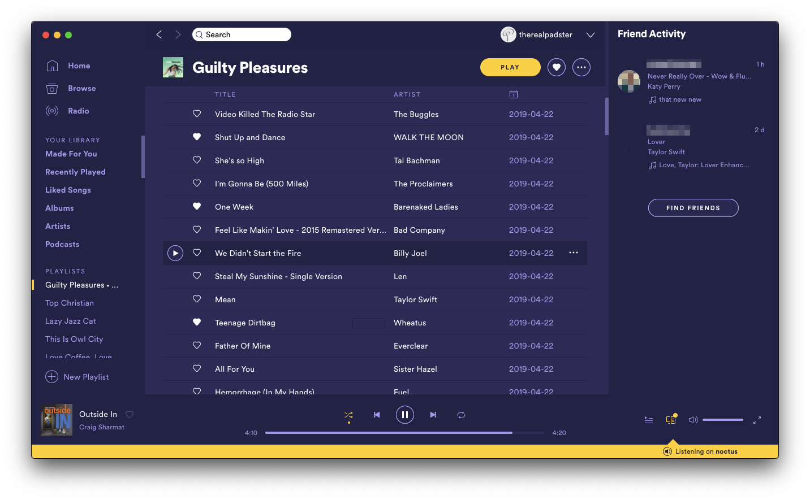

# Shades of Purple - Spotify theme

This theme was only for Spicetify v1, and no longer works in v2. I no longer have the time to maintain it, so will be archiving it. If you enjoy the theme and would update it to work with v2, feel free to contact me or make a fork. 

## Screenshots



## Requirements
The theme needs [spicetify](https://github.com/khanhas/spicetify-cli) in order to be installed.

## Installation

Just run these commands on a terminal:

```bash
git clone https://github.com/theRealPadster/shades-of-purple-spotify-theme
mv shades-of-purple-spotify-theme ~/.config/spicetify/Themes/
spicetify config current_theme shades-of-purple-spotify-theme
spicetify apply
```

## Development

* Run `spicetify watch` to keep Spicetify updating when CSS files change
* Run `yarn watch` to live convert less to css
* Edit the less files in the `src` directory. `_theme.less` is the main entry point. 

## Credits
* Colour scheme inspired by the [Shades of Purple VSCode theme](https://github.com/ahmadawais/shades-of-purple-vscode)
* Git repo and code starting point based on [Arc-Dark Spotify Theme](https://github.com/meliot/Arc-Dark-Spotify-Theme)
